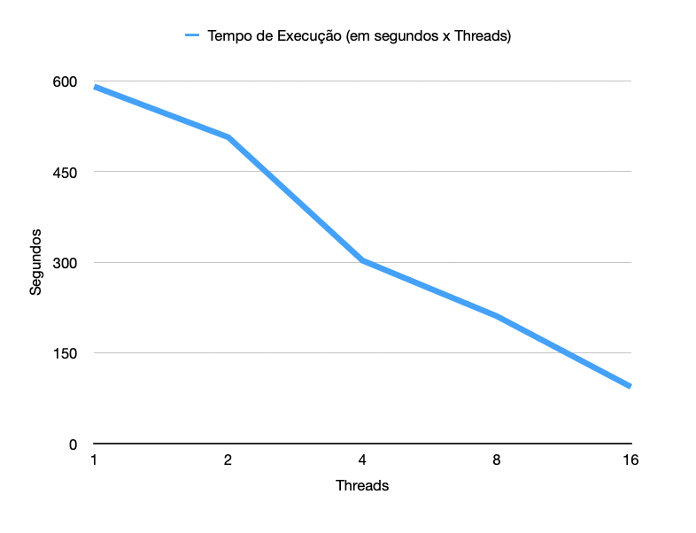
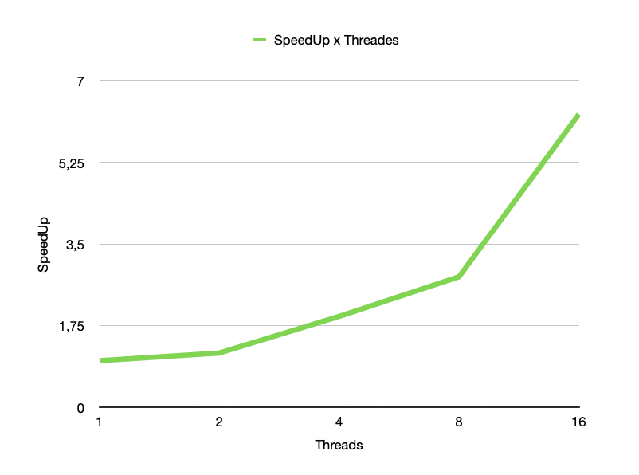
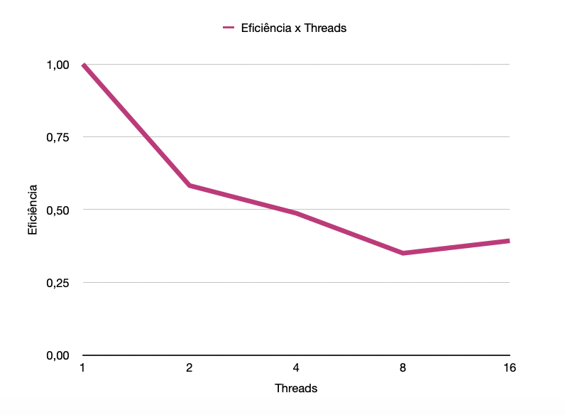
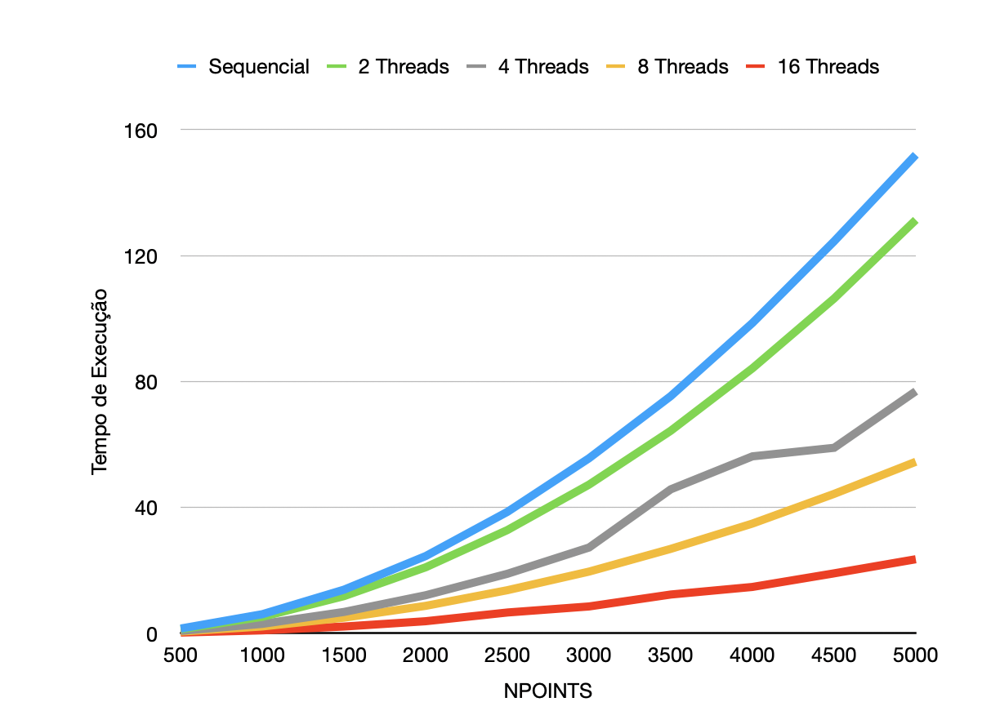

#Área de um Conjunto de Mandelbrot usando OpenMP

<div align="right">Alexandre Bing e Fabrício Pujol<br>
Porto Alegre, 21 de maio de 2020.
</div>

### <center> Resumo </center> 

<div align="justify" style="padding-right: 50px; padding-left:50px">O presente relatório pretende narrar a adaptação de um algoritmo sequencial para uma versão paralelizada, através do uso de OpenMP. Discutiremos as alternativas de paralelização e as vantagens e desvantagens de cada uma destas alternativas. Ao final, compararemos a versão sequêncial a diferêntes configurações de instâncias da versão paralela, incrementando o número de <i>threads</i> e analisando o possível ganho a cada incrementação.<br>

<b>Palavras-Chave:</b>Programação Paralela, Programação Sequencial, Paralelização, _OpenMP_, Conjunto de Mandelbrot.
</div>

### 1. Introdução

&nbsp;&nbsp;&nbsp;&nbsp;&nbsp;&nbsp;&nbsp;&nbsp;&nbsp;&nbsp;&nbsp;&nbsp;&nbsp;&nbsp;&nbsp;Ao buscarmos acelerar a execução de um software por conta de desempenho, o primeiro pensamento que nos ocorre é que talvez nosso processador não seja o suficiente para aquela máquina. Muitas vezes isso não é verdade. Alguns programas podem simplesmente não estar bem otimizados. Isso acontece quando uma aplicação não faz uso de recursos existentes na máquina de forma adequada, e algumas linhas de códigos são a barreira que existe entre uma execução rápida, ou uma prolongada.


&nbsp;&nbsp;&nbsp;&nbsp;&nbsp;&nbsp;&nbsp;&nbsp;&nbsp;&nbsp;&nbsp;&nbsp;&nbsp;&nbsp;&nbsp;Este relatório busca demonstrar essa premissa na prática ao testar diferentes versões e configurações de uma aplicação em um ambiente de _cluster_ de 16 CPUS Intel Xeon de 4 núcleos cada, disponibilizado na PUCRS, o _Lab Grad_. Verificaremos alternativas e abordagens para obtermos os melhores resultados possíveis, e compararemos a melhor alternativa consigo mesma, modificando apenas configurações de paralelização, com o objetivo de mostrar ao leitor quais foram os ganhos e custos de cada escolha.

### 2. O problema apresentado

#### 2.1 Definição


&nbsp;&nbsp;&nbsp;&nbsp;&nbsp;&nbsp;&nbsp;&nbsp;&nbsp;&nbsp;&nbsp;&nbsp;&nbsp;&nbsp;&nbsp;O Conjunto de Mandelbrot consiste em um fractal (figura geométrica não clássica onde as partes separadas repetem os padrões do todo completo) cuja razão é definida por uma condição inicial `z = c` e a iteração `z=z2+c` não diverege.


&nbsp;&nbsp;&nbsp;&nbsp;&nbsp;&nbsp;&nbsp;&nbsp;&nbsp;&nbsp;&nbsp;&nbsp;&nbsp;&nbsp;&nbsp;O desafio proposto consiste em paralelizar uma implementação sequencial de um programa que calcula a área de uma figura que pertence ao Conjunto de Mandelbrot, e realizar a comparação dos resultados encontrados de modo a se verificar o ganho de desempenho na comparação entre a versão sequencial e a paralelizada utilizando diferentes configurações do número de threads.

#### 2.2 Versão sequencial

&nbsp;&nbsp;&nbsp;&nbsp;&nbsp;&nbsp;&nbsp;&nbsp;&nbsp;&nbsp;&nbsp;&nbsp;&nbsp;&nbsp;&nbsp;A versão sequencial do programa foi fornecida inicialmente no enunciado do trabalho. A única alteração feita neste programa foi a inclusão de um novo laço externo que realiza uma iteração sobre o tamanho da área (em pontos) onde estaria inserido o fractal, que foi nossa compreensão sobre o que seria o número de NPOINTS que estamos incrementando gradualmente em 500 unidades.


&nbsp;&nbsp;&nbsp;&nbsp;&nbsp;&nbsp;&nbsp;&nbsp;&nbsp;&nbsp;&nbsp;&nbsp;&nbsp;&nbsp;&nbsp;Isso foi feito com base nos experimentos de aula que demonstraram essa como uma das alternativas para gerarmos todos os outputs com a execução do mesmo programa, e considerada a mais adequada tendo em vista o conhecimento e familiaridade dos autores deste relatório com _shellscript_.


&nbsp;&nbsp;&nbsp;&nbsp;&nbsp;&nbsp;&nbsp;&nbsp;&nbsp;&nbsp;&nbsp;&nbsp;&nbsp;&nbsp;&nbsp;Deste modo, a única alteração existente no código originalmente disponibilizado no enunciado foi:

```
int main(){

	...
	for (NPOINTS=500; NPOINTS <= 5000; NPOINTS += 500)
  	{

   		int numoutside = 0;
    	start = omp_get_wtime();
    	...

    	printf("Area of Mandlebrot set = %12.8f +/- %12.8f\n", area, error);
    	fprintf(stderr, "%d %12.8f\n", NPOINTS, finish - start);
    }
}
```

#### 2.3 Versão paralelizada


&nbsp;&nbsp;&nbsp;&nbsp;&nbsp;&nbsp;&nbsp;&nbsp;&nbsp;&nbsp;&nbsp;&nbsp;&nbsp;&nbsp;&nbsp;Para a versão paralelizada, consideramos algumas alternativas de implementação.


&nbsp;&nbsp;&nbsp;&nbsp;&nbsp;&nbsp;&nbsp;&nbsp;&nbsp;&nbsp;&nbsp;&nbsp;&nbsp;&nbsp;&nbsp;A primeira, e mais óbivia, foi a paralelização de um dos laços com a diretiva `#pragma omp parallel`. Analizando cada um dos 3 laços originais, verificamos que a pior opção seria pela paralelização do laço mais interno, por não existir uniformidade na sua execução. Isso é explicado pela presença de uma linha de código que interrompe a execução deste laço (linha 51 do código `areasParalelo.c`, que não torna essa opção possível.


&nbsp;&nbsp;&nbsp;&nbsp;&nbsp;&nbsp;&nbsp;&nbsp;&nbsp;&nbsp;&nbsp;&nbsp;&nbsp;&nbsp;&nbsp;Da mesma forma, a paralelização do laço intermediário também não parecia uma boa alternativa por existir dependência dos valores de `i`, que é atualizado pelo laço mais externo. Isso implicaria a criação de threads para cada iteração do laço mais externo e trancar sua execução.


&nbsp;&nbsp;&nbsp;&nbsp;&nbsp;&nbsp;&nbsp;&nbsp;&nbsp;&nbsp;&nbsp;&nbsp;&nbsp;&nbsp;&nbsp;Portanto, a opção de paralelizar o laço mais externo pareceu a mais adequada e segura, desde que pudessemos garantir que a execução de _threads_ para cada laço não interferisse na execução de outra.


&nbsp;&nbsp;&nbsp;&nbsp;&nbsp;&nbsp;&nbsp;&nbsp;&nbsp;&nbsp;&nbsp;&nbsp;&nbsp;&nbsp;&nbsp;Por esta razão, foram inclusas na declaração da paralelização as variáveis pertencentes a cada instância do laço, de forma a impedir que a execução de uma thread atualizasse dados que interferissem na execução da outra.

```
int main()
{
  int NPOINTS;
  double area, error, ztemp;
  double start, finish;
  struct complex z, c;

  for (NPOINTS=500; NPOINTS <= 5000; NPOINTS += 500)
  {
  	...
```


&nbsp;&nbsp;&nbsp;&nbsp;&nbsp;&nbsp;&nbsp;&nbsp;&nbsp;&nbsp;&nbsp;&nbsp;&nbsp;&nbsp;&nbsp;Analizando o trecho do código sequencial acima, as variáveis mais óbvias, em primeira análise, eram as definidas para a própria iteração dos laços, `i`, `j` e `iter`. A variável `NPOINTS` é na verdade uma constante dentro de cada iteração do programa estamos testando, e não é alterada nunca. Da mesma forma, as variáveis `start` e `finish` são executadas apenas após a finalização da execução dos 3 laços aninhados. Além de `i`, `j`, e `iter`, os structs `z` e `c` de `complex` devem possuir instâncias dentro de cada thread, para que a execução de uma _thread_ com essas variáveis não sobrescreva os resultados em outras. Deste modo, nossa diretiva de paralelização ficou da seguinte forma:

```
#pragma omp parallel private(i, j, iter, c, z, ztemp)
{
	//PARALLELIZING EXTERNAL LOOP
	#pragma omp for
    for (i = 0; i < NPOINTS; i++)
            {
            ...
	
```


&nbsp;&nbsp;&nbsp;&nbsp;&nbsp;&nbsp;&nbsp;&nbsp;&nbsp;&nbsp;&nbsp;&nbsp;&nbsp;&nbsp;&nbsp;Faltava apenas a questão de como lidar com a variável `numOutside`, que é utilizada fora do laço paralelizado, mas increnentada no laço mais externo caso os número complexos testados não façam parte do Conjunto de Mandelbrot. Por se tratar apenas se uma operação de incrementar essa variável, testamos o comportamento do programa mantendo esta variável fora do mais externo laço e permitindo que as _threads_ a incrementássem a seu bel prazer.


&nbsp;&nbsp;&nbsp;&nbsp;&nbsp;&nbsp;&nbsp;&nbsp;&nbsp;&nbsp;&nbsp;&nbsp;&nbsp;&nbsp;&nbsp;Entretanto, ao testarmos verificamos que os resultados não batiam com os da versão sequencial, e a explicação estava justamente na atualização concorrente que as _threads_ estavam fazendo na mesma variável, o que possibilitou que ela não fosse incrementada corretamente.


&nbsp;&nbsp;&nbsp;&nbsp;&nbsp;&nbsp;&nbsp;&nbsp;&nbsp;&nbsp;&nbsp;&nbsp;&nbsp;&nbsp;&nbsp;Tal fenômeno se consistia em uma sessão crítica identificada no trecho de código abaixo, onde muito provavelmente 2 _threads_ increamentaram a variável ao mesmo tempo e apenas uma das atualizações ficou registrada:

```
if ((z.real * z.real + z.imag * z.imag) > 4.0e0)
{
	numoutside++;
	break;
}
``` 


&nbsp;&nbsp;&nbsp;&nbsp;&nbsp;&nbsp;&nbsp;&nbsp;&nbsp;&nbsp;&nbsp;&nbsp;&nbsp;&nbsp;&nbsp;Naturalmente, a forma mais óbvia de contornar este problema seria definir uma seção crítica utilizando a diretiva `#pragma omp critical` imediatamente antes de atualizar o valor da variável. Entretanto, essa abordagem nos pareceu uma péssima alternativa, pois resultaria em incontáveis requisições de cada _thread_ para acessar a região crítica, já que ela se encontra no laço mais interno da aplicação.


&nbsp;&nbsp;&nbsp;&nbsp;&nbsp;&nbsp;&nbsp;&nbsp;&nbsp;&nbsp;&nbsp;&nbsp;&nbsp;&nbsp;&nbsp;Invés disso, optamos por criar uma variável auxiliar dentro do laço, que chamamos de `numoutsideAux`, declarada após a diretiva de paralelização e internamente em cada _thread_, inicializada com o valor atribuído de 0. Desta forma, a cada execução do laço mais interno, essa é a variável que é atualizada, onde cada _thread_ tem a sua instância de `numoutsideAux` e removemos a necessidade de muitos acessos sessão crítica de dentro do laço mais interno.


&nbsp;&nbsp;&nbsp;&nbsp;&nbsp;&nbsp;&nbsp;&nbsp;&nbsp;&nbsp;&nbsp;&nbsp;&nbsp;&nbsp;&nbsp;Optamos por mover a sessão crítica para fora do laço mais externo, quando o número total de casos que não passaram na condição do laço mais externo é incrementado pela variável auxiliar de cada thread.

```
int main()
{
	...
	int numoutside = 0
	
	#pragma omp parallel private(i, j, iter, c, z, ztemp)
    {
    	int numoutsideAux = 0
		//PARALLELIZING EXTERNAL LOOP
		#pragma omp for
       	for (i = 0; i < NPOINTS; i++)
          {
          	...
          }
            
		#pragma omp critical
       		numoutside += numoutsideAux  
	}
		...
	}
```


&nbsp;&nbsp;&nbsp;&nbsp;&nbsp;&nbsp;&nbsp;&nbsp;&nbsp;&nbsp;&nbsp;&nbsp;&nbsp;&nbsp;&nbsp;Com estas alterações, que constituem a versão final do nosso código fonte, finalizamos a implementação da versão paralela e passamos para os testes e resultados.


&nbsp;&nbsp;&nbsp;&nbsp;&nbsp;&nbsp;&nbsp;&nbsp;&nbsp;&nbsp;&nbsp;&nbsp;&nbsp;&nbsp;&nbsp;A versão utilizou o escalonamento _standard_ do _OpenMP_.

### 2. Resultados obtidos


&nbsp;&nbsp;&nbsp;&nbsp;&nbsp;&nbsp;&nbsp;&nbsp;&nbsp;&nbsp;&nbsp;&nbsp;&nbsp;&nbsp;&nbsp;Para fins de comparação dos resultados obtidos, fizemos a execução dos programas através de batchjobs com as configurações definidas das versões sequencial, 2, 4, 8 e 16 _threads_, três vezes para cada uma. Selecionamos, para todos os casos, as que foram executadas em menos tempo.


&nbsp;&nbsp;&nbsp;&nbsp;&nbsp;&nbsp;&nbsp;&nbsp;&nbsp;&nbsp;&nbsp;&nbsp;&nbsp;&nbsp;&nbsp;Utilizamos como tempo de execução o _elapsed time_ contido no resultado dos nossos arquivos `.batchjob`. 


&nbsp;&nbsp;&nbsp;&nbsp;&nbsp;&nbsp;&nbsp;&nbsp;&nbsp;&nbsp;&nbsp;&nbsp;&nbsp;&nbsp;&nbsp;Para o cálculo do SpeedUp, fizemos a comparação do tempo de execução da _thread_ corrente com a versão sequencial, através da fórmula:

\\[ speedup[p] = {T[1] \over T[p] }\\]


&nbsp;&nbsp;&nbsp;&nbsp;&nbsp;&nbsp;&nbsp;&nbsp;&nbsp;&nbsp;&nbsp;&nbsp;&nbsp;&nbsp;&nbsp;Onde `T[p]` corresponde a uma instância de execução em `p threads`.


&nbsp;&nbsp;&nbsp;&nbsp;&nbsp;&nbsp;&nbsp;&nbsp;&nbsp;&nbsp;&nbsp;&nbsp;&nbsp;&nbsp;&nbsp;Já a equação para a eficiência é dada por:

\\[ eficiencia[p] = {speedup[p] \over threads[p] }\\]


#### 3.1 Considerações dos resultados


&nbsp;&nbsp;&nbsp;&nbsp;&nbsp;&nbsp;&nbsp;&nbsp;&nbsp;&nbsp;&nbsp;&nbsp;&nbsp;&nbsp;&nbsp;As execuções de ambas as versões do programa, sequencial e paralela, foram realizadas no ambiente do _Lab Grad_. Os resultados obtidos apresentaram alguma variação quando havia mais de uma pessoa acessando o ambiente da PUCRS.


&nbsp;&nbsp;&nbsp;&nbsp;&nbsp;&nbsp;&nbsp;&nbsp;&nbsp;&nbsp;&nbsp;&nbsp;&nbsp;&nbsp;&nbsp;Desejávamos ainda incluir nos resultados considerações sobre diferentes experimentações de difrentes cláusulas de escalonamento nesta experimentação, o que será feito em caso de possibilidade de aditamento do presente relatório após a data de entrega.


&nbsp;&nbsp;&nbsp;&nbsp;&nbsp;&nbsp;&nbsp;&nbsp;&nbsp;&nbsp;&nbsp;&nbsp;&nbsp;&nbsp;&nbsp;Para fins de análise, incluímos também os 3 de cada versão do programa no arquivo `.zip`, onde constam os tempos de execução de cada iteração, e o tempo de execução e CPU do programa com todas as iterações.


&nbsp;&nbsp;&nbsp;&nbsp;&nbsp;&nbsp;&nbsp;&nbsp;&nbsp;&nbsp;&nbsp;&nbsp;&nbsp;&nbsp;&nbsp;Desta forma, considerando apenas as execuções levadas em conta nos resultados apresentados, foi utilizado um total de tempo de CPU de 49 minutos e 49 segundos.

### 3.2 Gráficos de desempenho


&nbsp;&nbsp;&nbsp;&nbsp;&nbsp;&nbsp;&nbsp;&nbsp;&nbsp;&nbsp;&nbsp;&nbsp;&nbsp;&nbsp;&nbsp;Inicialmente, vamos analisar o tempo de execução de cada versão do nosso programa. A distinção entre as várias configurações de número de _threads_. Em nossos testes, o maior ganho de desempenho a cada vez que dobrávamos o número de _threads_ foi quando definimos um número de 4 _threds_, que teve a curva mais acentuada.




&nbsp;&nbsp;&nbsp;&nbsp;&nbsp;&nbsp;&nbsp;&nbsp;&nbsp;&nbsp;&nbsp;&nbsp;&nbsp;&nbsp;&nbsp;Já em se analizando o _speedup_, podemos verificar que esse aumento é cada vez mais acentuado, principalmente por estarmos sempre comparando esse ganho em relação à versão sequencial. 




&nbsp;&nbsp;&nbsp;&nbsp;&nbsp;&nbsp;&nbsp;&nbsp;&nbsp;&nbsp;&nbsp;&nbsp;&nbsp;&nbsp;&nbsp;Finalmente, na relação entre eficiência e o número de _threads_, pudemos perceber que a primeira vez que dobramos o número destas, a eficiência de cada _thread_ caia drasticamente, exatamente porque nós dobramos este número, e o tempo de execução não caiu de forma muito dramática. Mas a medida em que aumentamos o número de _threads_, verificamos uma tendência de desaceleração dessa curva, chegando a um ponto específico (de 8 a 16 _threads_) onde inclusive tivemos um ganho de eficiência.





&nbsp;&nbsp;&nbsp;&nbsp;&nbsp;&nbsp;&nbsp;&nbsp;&nbsp;&nbsp;&nbsp;&nbsp;&nbsp;&nbsp;&nbsp;Finalmente, para fins de análise, usamos esta sessão para exibir o tempo interno de execução conforme o número de NPOINTS. É fácil perceber que quanto menos _threads_ utilizamos, mais a complexidade do problema se acentua frente ao tempo de execução.





### 4.Conclusão


&nbsp;&nbsp;&nbsp;&nbsp;&nbsp;&nbsp;&nbsp;&nbsp;&nbsp;&nbsp;&nbsp;&nbsp;&nbsp;&nbsp;&nbsp;Um mesmo programa foi capaz de ser executado, em um mesmo _cluster_, com desempenhos bastante diferentes. Apesar de toda capacidade computacional do ambiente, a versão sequencial demonstra um subaproveitamento bastante elevado da capacidade computacional, resultando em uma execução longa e desnecessária. 


&nbsp;&nbsp;&nbsp;&nbsp;&nbsp;&nbsp;&nbsp;&nbsp;&nbsp;&nbsp;&nbsp;&nbsp;&nbsp;&nbsp;&nbsp;Com poucas linhas de código, nos lugares corretos, tivemos um ganho de 10 vezes de velocidade de execução, ganho que poderia ser ainda melhor, experimentando-se diferentes diretivas de escalonamento do _OpenMP_.


&nbsp;&nbsp;&nbsp;&nbsp;&nbsp;&nbsp;&nbsp;&nbsp;&nbsp;&nbsp;&nbsp;&nbsp;&nbsp;&nbsp;&nbsp;Obviamente, como tudo na computação, os ganhos não são gratuitos e pudemos observar alguns dos seus custos. O primeiro deles é a perda de eficiência, que ocorre porque o processo de paralelização pode momentaneamente deixar alguma _thread_ ociosa. Observamos, porém, que esta perda de eficiência tende a diminuir, nos casos observados.


&nbsp;&nbsp;&nbsp;&nbsp;&nbsp;&nbsp;&nbsp;&nbsp;&nbsp;&nbsp;&nbsp;&nbsp;&nbsp;&nbsp;&nbsp;Percebemos, também, uma leve queda no ganho de tempo de execução a partir de 4 _threads_, o que pode ter ocorrido por casualidade devido ao compartilhamento de recursos do _cluster_ com outros usuários (pode-se observar um comportamento levemente distinto do funcionamento da aplicação utilizando 8 _threads_). Entretanto, este comportamento mostrou-se consistente nos testes executados.


&nbsp;&nbsp;&nbsp;&nbsp;&nbsp;&nbsp;&nbsp;&nbsp;&nbsp;&nbsp;&nbsp;&nbsp;&nbsp;&nbsp;&nbsp;Finalmente, restou inegável que a paralelização da execução e incremento do número de _threads_ utilizadas aumentou drasticamente o desempenho de um mesmo programa, em um mesmo _cluster_.

<div style="page-break-after: always;"></div>

### Referências

Aldicio J. Miranda; Fractais: Conjuntos de Julia e Conjuntos de Mandelbrot(disponível [aqui](https://www.google.com/url?sa=t&rct=j&q=&esrc=s&source=web&cd=11&ved=2ahUKEwiy0dy588XpAhW-G7kGHRFdBRwQFjAKegQIARAB&url=https%3A%2F%2Fpublicacoes.unifal-mg.edu.br%2Frevistas%2Findex.php%2Fsigmae%2Farticle%2Fview%2F97%2F32&usg=AOvVaw14LnkkxrJax4poxwE693Cc))

IME-USP; Processamento Paralelo (disponível [aqui](http://www.inf.unioeste.br/~guilherme/tsc/aula9.pdf))


